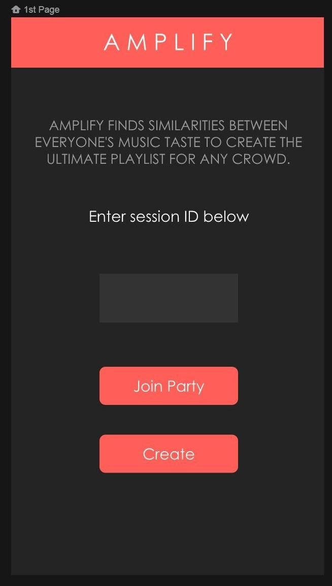
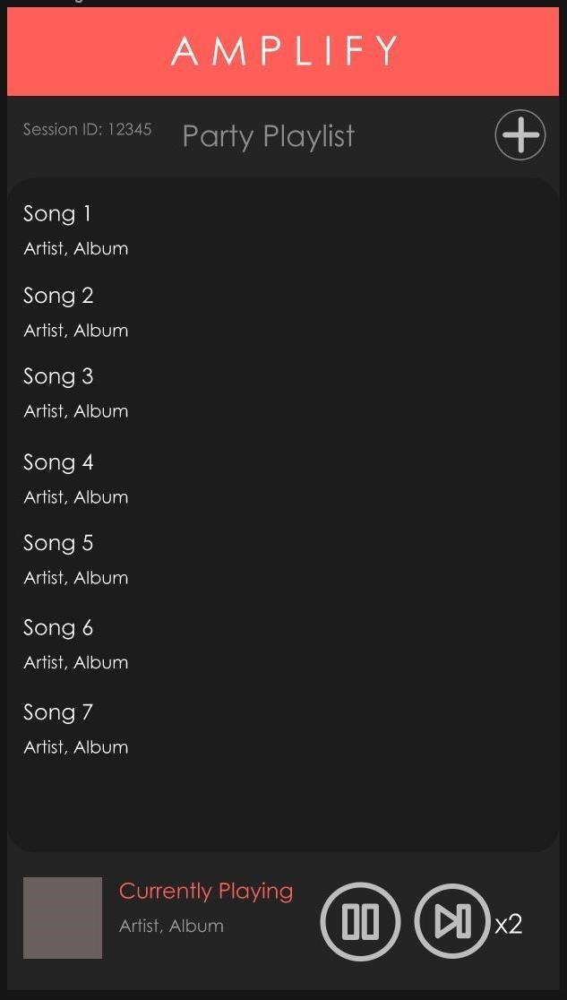
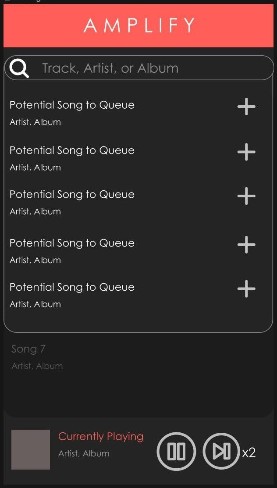

# Amplify

Amplify is an application designed to connect with each other through shared music. Amplify allows a group of people to instantly sync their music tastes to create one playlist that everyone can enjoy... perfect for car rides or parties!
Using Spotify, you connect to one person's hosted party and the application will create the ultimate playlist based on everyone's listening history.
   

## Requirements
An active spotify account and the spotify app on your device. 
 
 ## App Preview

