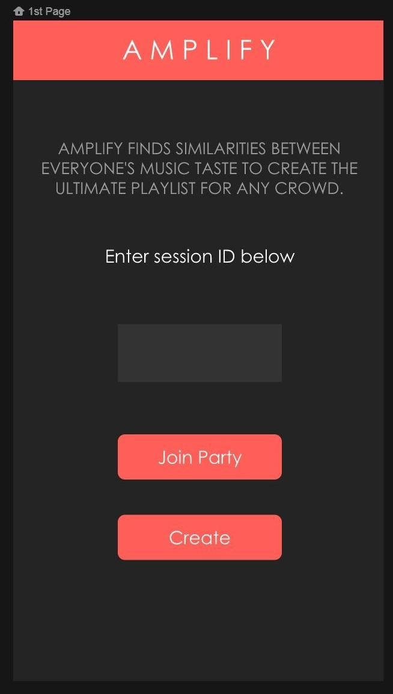
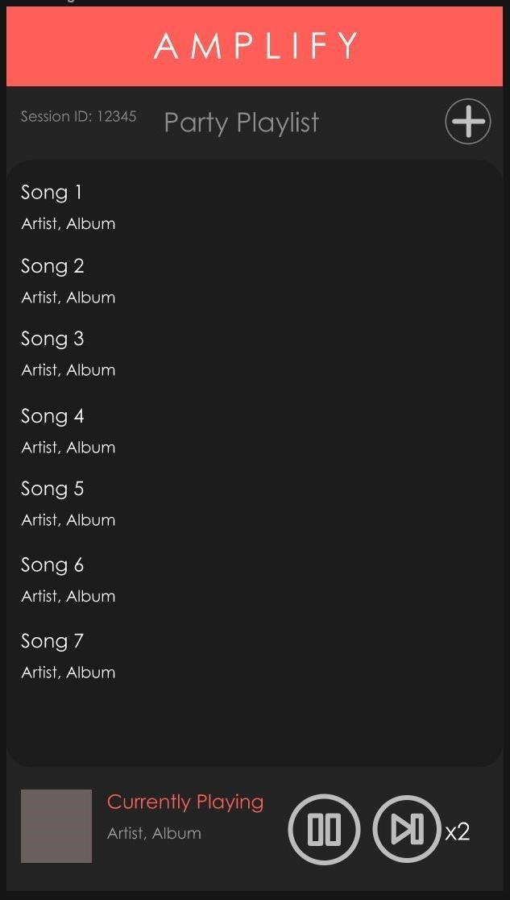
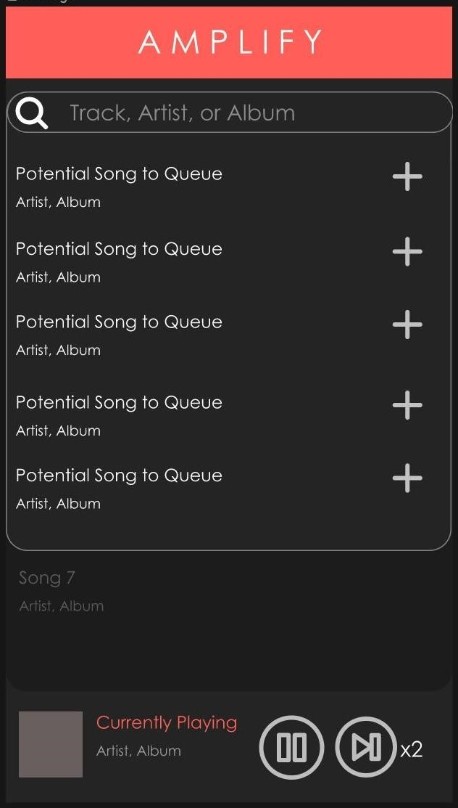

# Amplify

Amplify is an application designed to connect with each other through shared music. Amplify allows a group of people to instantly sync their music tastes to create one playlist that everyone can enjoy... perfect for car rides or parties!
Using Spotify, you connect to one person's hosted party and the application will create the ultimate playlist based on everyone's listening history.
   
## Setup
In order to get things up and running with this repository:  
1. Download [Spotify's App Remote SDK](https://github.com/spotify/android-sdk/releases) 
2. Then add a new module to the project (File -> New -> New Module)  
3. Select "Import JAR/.AAR Package"  
4. Choose correct file name path to your unzipped App Remote SDK  
5. Set the subproject name to spotify-app-remote  
    
For additional information please see [Spotify's documentation](https://developer.spotify.com/documentation/android/quick-start/#create-your-app)
       
 
 ## App Preview

